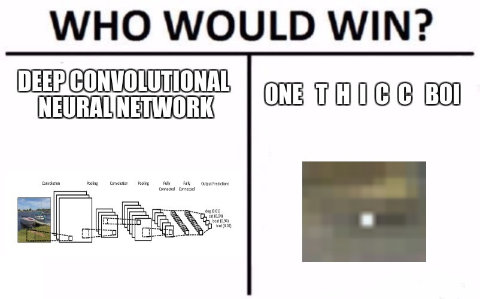
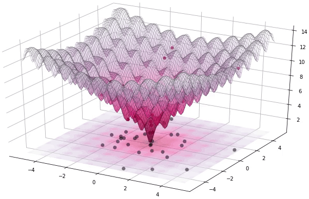
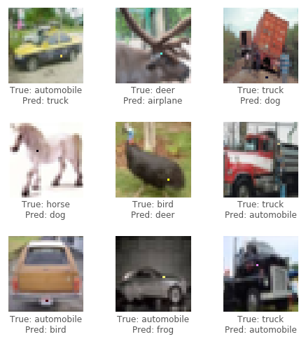

# One Pixel Attack

[](https://www.reddit.com/r/ProgrammerHumor/comments/79g0m6/one_pixel_attack_for_fooling_deep_neural_networks/?ref=share&ref_source=link)

How simple is it to cause a deep neural network to misclassify an image if we are only allowed to modify the color of one pixel and only see the prediction probability? Turns out it is very simple. In many cases, we can even cause the network to return any answer we want.

The following project is a Keras reimplementation and tutorial of ["One pixel attack for fooling deep neural networks"](https://arxiv.org/abs/1710.08864).

## How It Works

For this attack, we will use the [Cifar10 dataset](https://www.cs.toronto.edu/~kriz/cifar.html). The task of the dataset is to correctly classify a 32x32 pixel image in 1 of 10 categories (e.g., bird, deer, truck). The black-box attack requires only the probability labels (the probability value for each category) that get outputted by the neural network. We generate adversarial images by selecting a pixel and modifying it to a certain color.

By using an Evolutionary Algorithm called Differential Evolution (DE), we can iteratively generate adversarial images to try to minimize the confidence (probability) of the neural network's classification.

[](https://en.wikipedia.org/wiki/Differential_evolution)

First, generate several adversarial samples that modify a random pixel and run the images through the neural network. Next, combine the previous pixels' positions and colors together, generate several more adversarial samples from them, and run the new images through the neural network. If there were pixels that lowered the confidence of the network from the last step, replace them as the current best known solutions. Repeat these steps for a few iterations; then on the last step return the adversarial image that reduced the network's confidence the most. If successful, the confidence would be reduced so much that a new (incorrect) category now has the highest classification confidence.

See below for some examples of successful attacks:

[](one-pixel-attack.ipynb)

## Getting Started

A dedicated GPU suitable for running with Keras is recommended to run the tutorial. Alternatively, you can [view the tutorial notebook on GitHub](one-pixel-attack.ipynb).

1. Install the python packages in requirements.txt if you don't have them already.

```bash
pip install -r ./requirements.txt
```

2. Clone the repository.

```bash
git clone https://github.com/Hyperparticle/one-pixel-attack
cd ./one-pixel-attack
```

3. Run the iPython tutorial notebook with Jupyter.

```bash
jupyter notebook ./one-pixel-attack.ipynb
```

## Training and Testing

TODO: need to implement a CLI!

## Milestones

- [x] Cifar10 dataset
- [x] Tutorial notebook
- [x] Lecun Network, Network in Network, Residual Network, DenseNet models
- [ ] Configurable command-line interface
- [ ] Efficient differential evolution implementation
- [ ] MNIST dataset
- [ ] ImageNet dataset
- [ ] Test on Capsule Networks
